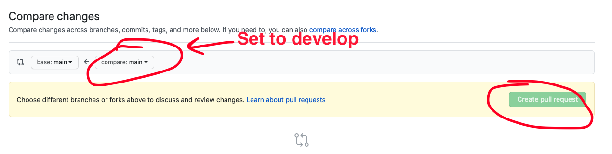

# Exa Punks

## Overview

In this project, you will practice programming "hacking robots" in a video game called Exa Punks. This game will challenge you to solve puzzles that are very similar to programming puzzles you will see on the AP CSP Exam. Additionally, you will practice yet another programming language and begin to understand and practice using Lists and Loops in your programming. Something to note is that the programming that is done in Exa Punks is very similar to programming in assembly. Assembly is the language that your computer speaks and all programs compile to this language and are sent to the CPU.

* [Setup your repository](#setup-your-repository)
  * [Sign up for the project](#sign-up-for-project)
* [Milestones](#milestones)
  * [Milestone 1](#milestone-1)
  * [Milestone 2](#milestone-2)
  * [Milestone 3](#milestone-3)
* [Grading](#grading)
  * [Computational Thinking](#computational-thinking)
  * [Computing, Programming and Practice](#computing-programming-and-practice)
  * [Skills of a Student](#skills-of-a-student)
* [Getting Help](#getting-help)

## Setup your repository

### Sign up for Project

Sign up for the project repository here: [https://classroom.github.com/a/YraeNce3](https://classroom.github.com/a/YraeNce3)

After your repository has initialized it, clone it to your computer. I recommend
putting it in your `ap-csp` directory.

After you've cloned your repository, run the `setup.sh` script in the root of
that repository to initialize it's configuration.

Upon completion it should display a message similar to this one:

```
######################################################
# SETUP IS COMPLETE. YOU SHOULD NOW CREATE A         #
# `develop` BRANCH BY RUNNING THE FOLLOWING COMMAND: #
#                                                    #
# git checkout -b develop                            #
#                                                    #
# THEN PUSH THAT BRANCH TO GITHUB BY RUNNING THE     #
# FOLLOWING COMMAND:                                 #
#                                                    #
# git push -u origin develop                         #
#                                                    #
# AFTER PUSHING, OPEN A PULL REQUEST FROM YOUR       #
# `develop`  BRANCH TO THE `main` BRANCH BY VISITING #
# THIS REPO ON GITHUB, CLICKING `Pull Requests`      #
# THEN `New pull request`. THE BASE BRANCH SHOULD BE #
# `main` and THE COMPARE BRANCH SHOULD BE `develop`. #
#                                                    #
# FINALLY, ADD YOUR INSTRUCTOR AS A REVIEWER ON      #
# GITHUB. THIS IS HOW YOUR INSTRUCTOR WILL SEE YOUR  #
# WORK.                                              #
######################################################
```

Follow the directions to create a `develop` branch as well as pushing your
`develop` branch to Github.

Finally, create a pull request from your `develop` branch to the `main` branch
and assign `jcollard` as a reviewer.





## ExaPunks

### Download the Game

Windows Version: [LINK](https://drive.google.com/file/d/1SGFZclnze9DAdn_eNZJ6dayXy4CDWuHJ/view?usp=sharing)

Mac Version: [LINK](https://drive.google.com/file/d/1xYwRFo-K3MmFkkraUGbnu3bKR95mjqET/view?usp=sharing)

### Trash World News

Trash World News is a fictional zine from the Exa Punk video game. However, it reads very similarily to many APIs (Applictaon Programming Interface). This PDF will be your guide to solving the puzzles in the game and progressing. In fact, there are 4 tutorials in this zine that will walk you through the first 4 puzzles. You will also need to use the references to truly understand how the Nano bots in the game work. As always, if you have questions, do not hesitate to ask!

Here is a link to the manual: [PDF](https://drive.google.com/file/d/11PH0kUnvpU0FxVH31MHNJIsw5im7GfMa/view?usp=sharing)

### Submitting Puzzle Solutions

Each puzzle solution should be submitted in your repository. Create a new directory path for each puzzle with the following format `solutions/###-PUZZLENAME`.  Each directory should contain a file for each of the bots programs. For example, the screenshot here shows the puzzle selection interface within EXA Punks. The naming convention for several of the puzzles is below the screenshot.


* `solutions/01-trash-world-news/XA.txt`
* `solutions/02-trash-world-news/XA.txt`
* `solutions/03-trash-world-news/XA.txt`
* `solutions/04-trash-world-news/XA.txt`
* `solutions/05-euclids-pizza/XA.txt`

### Working Together

For each puzzle, you may work in groups of 2. Be sure to note in your puzzle solutions who you worked with on each puzzle.

## Milestones

### Milestone 1

Due Date: Thursday January 14th @ 8AM

 Complete the tutorial programs and the first two non-tutorial puzzle in Exa Punks. When you're finished you should have 6 directories added to your repository:

* `solutions/01-trash-world-news/`
* `solutions/02-trash-world-news/`
* `solutions/03-trash-world-news/`
* `solutions/04-trash-world-news/`
* `solutions/05-euclids-pizza/`
* `solutions/06-mitsuzen-hdi-10/`

All code that you would like to count toward your evaluation should be part of a
`tag` on in your repository called `milestone-1`. This can be created by running
`git tag milestone-1`. Then push your tag to your repository by running `git
push -u origin milestone-1`. The date of this tag creation will be used to
determine when your work was submitted.

### Milestone 2

Due Date: Thursday November 21th @ 8AM

Continue to hack your way through Exa Punks by completing the next 5 puzzles. Some of these puzzles are quite challenging so be sure to pace them out over several days so you can ask questions if necessary. When you're finished you should have 11 directories in your repository:

* `solutions/07-last-stop-snaxnet/`
* `solutions/08-zebros-copies/`
* `solutions/09-sfcta-highway-sign/`
* `solutions/10-unknown-network-1/`
* `solutions/11-uc-berkeley/`

All code that you would like to count toward your evaluation should be part of a
`tag` on in your repository called `milestone-2`. This can be created by running
`git tag milestone-2`. Then push your tag to your repository by running `git
push -u origin milestone-2`. The date of this tag creation will be used to
determine when your work was submitted.

### Milestone 3

Due Date: Monday November 25th @ 8AM

Complete the next 4 puzzles and unlock the second Trash World News Zine. At this point you should have the following directories in your repository. Note: These puzzles are the hardest puzzles thus far and will only get you to the Proficient category. Be sure to start early so you can complete them and the Advanced section of the project.

* `solutions/12-workhouse/`
* `solutions/13-equity-first-bank/`
* `solutions/14-mitsuzen-hdi-10/`
* `solutions/15-trash-world-news/`

Once you have completed puzzle 15, you will unlock a new magazine with new commands and a new way to play the game: KGOG-TV and TEC REDSHIFT. Completing either of these puzzles will unlock a new game mode that will allow you to receive an Advanced score in Computational Thinking

#### KGOG-TV

In this puzzle, you compete against other Nano-bots. Completing this puzzle will allow you to play in a multiplayer version of the game against other students. Compete against at least one other student (or Mx. Collard) and submit your bot solution as well as a write up about your strategy.

#### TEC REDSHIFT

TEC REDSHIFT is essentially the Exa Punk version of a handheld game console like a Gameboy or Switch. Completing this puzzle unlocks the REDSHIFT HOMEBREW mode of this game and allows you to program the TEC REDSHIFT. Design a program to run on the TEC REDSHIFT and submit it along with a write up describing the program.

All code that you would like to count toward your evaluation should be part of a
`tag` on in your repository called `milestone-3`. This can be created by running
`git tag milestone-3`. Then push your tag to your repository by running `git
push -u origin milestone-3`. The date of this tag creation will be used to
determine when your work was submitted. submitted. 

## Grading

#### Computational Thinking

| Advanced                                                 | Proficient                                                            | Basic                                               | Below Basic                                                      |
|----------------------------------------------------------|-----------------------------------------------------------------------|-----------------------------------------------------|------------------------------------------------------------------|
| Student completes the TEC REDSHIFT or KGOG-TV Challenges | Student completes all puzzles listed in Milestone 2                   | Student completes the puzzles listed in Milestone 1 | Student does not complete the tutorial or puzzles in Milestone 1 |
| Student completes all puzzles listed in Milestone 3      | Student makes an effort to complete the puzzles listed in Milestone 3 |                                                     |                                                                  |

### Computing, Programming and Practice

| Advanced                                                                                                       | Proficient                                                              | Basic                                                                          | Below Basic                              |
|----------------------------------------------------------------------------------------------------------------|-------------------------------------------------------------------------|--------------------------------------------------------------------------------|------------------------------------------|
| Student utilizes the `NOTE` command to document almost all of their Nanobots code                              | Student uses the `NOTE` command to document some of their Nanobots code | Student documents less than half of their Nanobot code with the `NOTE` command | Student does not use the `NOTE` command  |
| Student documents any help they received, students they worked with, or sources they used to solve each puzzle | Student follows commit template most of the time                        | Student frequently does not follow the commit template                         | Student does not use the commit template |
| Students always follows the commit template                                                                    |                                                                         |                                                                                |                                          |

### Skills of a Student

Your skills of a student covers your StudentLog repository, your in class time
management, meeting deadlines, asking for help when needed, and helping others
when able.

| Advanced                                                                           | Proficient                   | Basic                                                    | Below Basic                                          |
|------------------------------------------------------------------------------------|------------------------------|----------------------------------------------------------|------------------------------------------------------|
| Manages time well in class, stays focused on work  at hand at all times            | Focuses on work in class     | Focuses at times, can get distracted                     | Uses class time poorly, is frequently distracted     |
| Meets all deadlines, on or ahead of schedule                                       | Meets deadlines              | Delivers close to deadline, may be late  by a day or two | Delivers work late or not at all                     |
| Advocates for self, seeks clarification when needed  and volunteers to help others | Seeks assistance when needed | Needs prompting to seek assistance                       | Does not seek assistance or ask for help when needed |

## Getting Help

All questions should be posted to the class Piazza board. You are also
encouraged to help other students who post on Piazza. When you post your
question, be sure to include as many details as possible for reproducing the
issue you're having.

Questions you should answer when asking a question include:

1. What are you trying to do?
2. What did you try?
3. What was the result?

Work hard to make sure the person trying to answer your question can reproduce
your error. Share your files so others can run exactly what you're running.

Also, include screenshot!

Formulating good questions is a good life long skill. You should try asking your
question on Piazza before seeking out synchronous time with Mx. Collard.
However, if you would like to meet to discuss synchronously, first, look at [Mx.
Collard's Calendar](http://tinyurl.com/mx-collard-calendar), then send them an
email with at least two proposed times you would like to meet.
